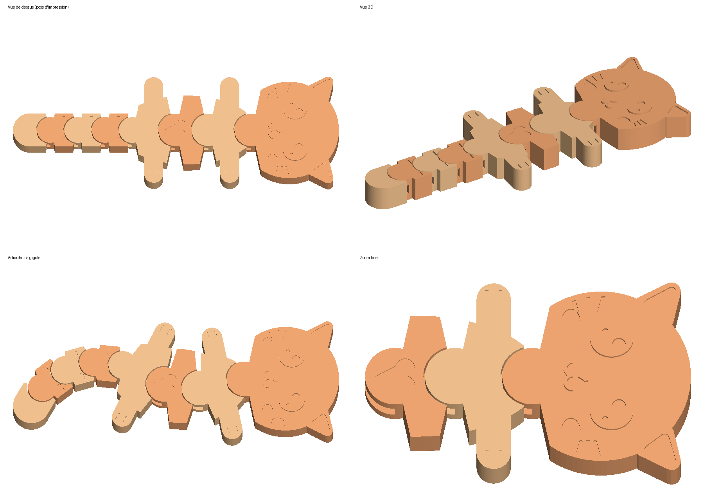

# Chat kawaii articulé (flexi, print-in-place)



- `chat_flexi.stl` : le fichier à imprimer (138 × 47 × 11 mm, ~32 cm³)
- `chat_flexi.py` : générateur paramétrique (Python + manifold3d)
- `verif.py` : vérifie les jeux et l'amplitude des articulations
- `rendu.py` : génère `apercu.png`

8 pièces imprimées déjà emboîtées : tête, 3 segments de corps (pattes avant,
dos avec cœur, pattes arrière), 3 segments de queue et le bout de la queue.
Chaque articulation pivote d'environ ±25 à 30°.

## Réglages d'impression conseillés

| Réglage | Valeur |
|---|---|
| Buse | 0,4 mm |
| Hauteur de couche | 0,2 mm (important pour les jeux verticaux de 0,5 mm) |
| Supports | **aucun** |
| Remplissage | 15 à 20 % |
| Parois | 2 à 3 |
| Matériau | PLA |
| Bordure (brim) | non, ou très fine : elle collerait les segments entre eux |

Posez-le à plat, tel quel. Première couche bien réglée : si elle est écrasée,
les segments peuvent se souder par le bas.

**Après impression**, plier doucement chaque articulation à gauche puis à
droite pour décoller les ponts : les segments se libèrent en faisant « clic ».

## Modifier

```bash
pip install manifold3d trimesh numpy pillow
python3 chat_flexi.py      # régénère chat_flexi.stl
python3 verif.py           # contrôle jeux et amplitude
python3 rendu.py           # régénère apercu.png
```

Si les articulations sont trop dures (imprimante peu précise), augmenter
`C` (jeu horizontal, 0.4 → 0.5) en haut de `chat_flexi.py`.
